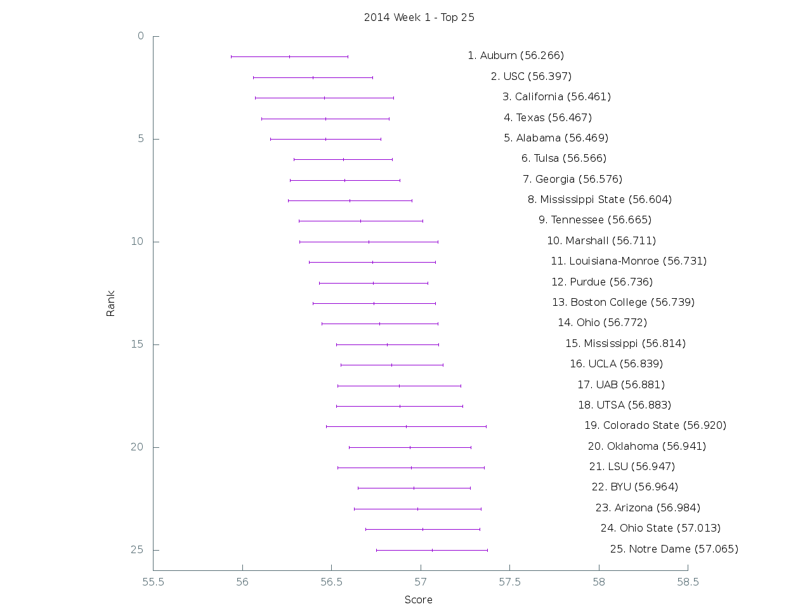

[Graph of all teams](img/week1.png)

 Rank | Team                           | Score      | Uncertainty
------|--------------------------------|------------|------------
    1 | Auburn                    |  56.265900 |   0.326640
    2 | USC                       |  56.396700 |   0.334496
    3 | California                |  56.461300 |   0.389138
    4 | Texas                     |  56.466600 |   0.356634
    5 | Alabama                   |  56.469300 |   0.310435
    6 | Tulsa                     |  56.566500 |   0.275528
    7 | Georgia                   |  56.575800 |   0.307059
    8 | Mississippi State         |  56.604200 |   0.346738
    9 | Tennessee                 |  56.665400 |   0.346498
   10 | Marshall                  |  56.710800 |   0.387534
   11 | Louisiana-Monroe          |  56.731100 |   0.353588
   12 | Purdue                    |  56.736000 |   0.304794
   13 | Boston College            |  56.738600 |   0.343314
   14 | Ohio                      |  56.771900 |   0.327037
   15 | Mississippi               |  56.813700 |   0.286609
   16 | UCLA                      |  56.839000 |   0.286397
   17 | UAB                       |  56.881400 |   0.343684
   18 | UTSA                      |  56.883300 |   0.354018
   19 | Colorado State            |  56.920000 |   0.448924
   20 | Oklahoma                  |  56.940900 |   0.341686
   21 | LSU                       |  56.947400 |   0.409555
   22 | BYU                       |  56.964400 |   0.316050
   23 | Arizona                   |  56.984500 |   0.354895
   24 | Ohio State                |  57.013300 |   0.321330
   25 | Notre Dame                |  57.065200 |   0.312099
   26 | Nebraska                  |  57.066800 |   0.324970
   27 | North Carolina State      |  57.084800 |   0.306779
   28 | Texas A&M                 |  57.210800 |   0.286712
   29 | Washington                |  57.260100 |   0.374124
   30 | Rutgers                   |  57.289700 |   0.265496
   31 | Michigan                  |  57.359000 |   0.333074
   32 | Baylor                    |  57.373400 |   0.387204
   33 | Western Kentucky          |  57.380500 |   0.400172
   34 | Temple                    |  57.443600 |   0.321530
   35 | UTEP                      |  57.485200 |   0.317286
   36 | Florida State             |  57.539000 |   0.328105
   37 | Penn State                |  57.816400 |   0.334450
   38 | Arizona State             |  61.537900 |   0.434430
   39 | Kansas                    |  61.844900 |   0.330894
   40 | Georgia Tech              |  61.871300 |   0.416922
   41 | Toledo                    |  61.872200 |   0.392676
   42 | Middle Tennessee          |  62.026200 |   0.441175
   43 | Texas Tech                |  62.045100 |   0.411159
   44 | Old Dominion              |  62.079800 |   0.399047
   45 | Louisville                |  62.089900 |   0.444205
   46 | Idaho                     |  62.154700 |   0.362939
   47 | Syracuse                  |  62.168100 |   0.434279
   48 | Oregon                    |  62.187900 |   0.344355
   49 | Eastern Michigan          |  62.209700 |   0.421346
   50 | Maryland                  |  62.240300 |   0.382942
   51 | Virginia Tech             |  62.256900 |   0.354287
   52 | Northern Illinois         |  62.297800 |   0.385344
   53 | Buffalo                   |  62.336500 |   0.398631
   54 | TCU                       |  62.360300 |   0.421423
   55 | Georgia State             |  62.377300 |   0.381682
   56 | Central Michigan          |  62.395900 |   0.359399
   57 | South Florida             |  62.415000 |   0.415204
   58 | Kentucky                  |  62.458400 |   0.355119
   59 | Akron                     |  62.583300 |   0.349448
   60 | Pittsburgh                |  62.628300 |   0.492572
   61 | Stanford                  |  62.634400 |   0.450331
   62 | Memphis                   |  62.665600 |   0.357802
   63 | Duke                      |  62.675500 |   0.429945
   64 | Arkansas State            |  62.728300 |   0.388857
   65 | Ball State                |  62.747400 |   0.384272
   66 | Florida                   |  62.766500 |   0.446599
   67 | Air Force                 |  62.781100 |   0.401959
   68 | Utah                      |  62.791400 |   0.460381
   69 | Kansas State              |  62.795100 |   0.372200
   70 | Wyoming                   |  62.835100 |   0.407525
   71 | Illinois                  |  62.843500 |   0.399405
   72 | Minnesota                 |  62.894300 |   0.417927
   73 | South Alabama             |  62.897700 |   0.316817
   74 | Missouri                  |  62.936800 |   0.326295
   75 | Indiana                   |  62.947400 |   0.426900
   76 | Nevada                    |  62.953800 |   0.373855
   77 | Oregon State              |  62.969300 |   0.335601
   78 | Michigan State            |  62.982000 |   0.394471
   79 | East Carolina             |  62.988600 |   0.320119
   80 | Miami (Fla.)              |  63.003100 |   0.308507
   81 | Louisiana-Lafayette       |  63.031800 |   0.360790
   82 | Iowa                      |  63.060900 |   0.389213
   83 | San Diego State           |  63.129200 |   0.370151
   84 | North Carolina            |  63.164600 |   0.379644
   85 | New Mexico State          |  63.207700 |   0.415040
   86 | San Jose State            |  63.303500 |   0.345248
   87 | Cincinnati                |  63.419200 |   0.343287
   88 | Army                      |  63.558600 |   0.388097
   89 | Texas State               |  63.578700 |   0.424599
   90 | Wake Forest               |  67.056400 |   0.404134
   91 | Miami (Ohio)              |  67.214600 |   0.321827
   92 | Florida Atlantic          |  67.281500 |   0.327107
   93 | Fresno State              |  67.405300 |   0.288374
   94 | Hawaii                    |  67.483800 |   0.304977
   95 | Massachusetts             |  67.570200 |   0.338434
   96 | Bowling Green             |  67.571600 |   0.329063
   97 | Connecticut               |  67.585300 |   0.325878
   98 | Kent State                |  67.593400 |   0.382246
   99 | Boise State               |  67.634500 |   0.339322
  100 | Georgia Southern          |  67.640100 |   0.365063
  101 | Arkansas                  |  67.663100 |   0.286901
  102 | SMU                       |  67.774600 |   0.315843
  103 | Colorado                  |  67.809300 |   0.353199
  104 | Louisiana Tech            |  67.816800 |   0.334026
  105 | Tulane                    |  67.836400 |   0.315009
  106 | New Mexico                |  67.841900 |   0.306169
  107 | Washington State          |  67.846600 |   0.321951
  108 | Navy                      |  67.862100 |   0.363554
  109 | Northwestern              |  67.954600 |   0.348664
  110 | West Virginia             |  67.966000 |   0.339330
  111 | Wisconsin                 |  67.971400 |   0.381891
  112 | Virginia                  |  67.993300 |   0.348597
  113 | Houston                   |  68.009100 |   0.431569
  114 | Vanderbilt                |  68.024300 |   0.361911
  115 | Troy                      |  68.050300 |   0.344416
  116 | South Carolina            |  68.070200 |   0.346881
  117 | UNLV                      |  68.089100 |   0.254445
  118 | Western Michigan          |  68.143200 |   0.312810
  119 | Rice                      |  68.149500 |   0.337503
  120 | Southern Miss             |  68.229200 |   0.284624
  121 | Clemson                   |  68.248500 |   0.384014
  122 | Oklahoma State            |  68.249700 |   0.261179
  123 | Appalachian State         |  68.383600 |   0.360362
  124 | Utah State                |  68.476800 |   0.354914
  125 | North Texas               |  68.522100 |   0.367252
  126 | UCF                       |  68.530300 |   0.357584
  127 | Iowa State                | 126.000000 |   0.000000
  128 | Florida International     | 127.000000 |   0.000000
