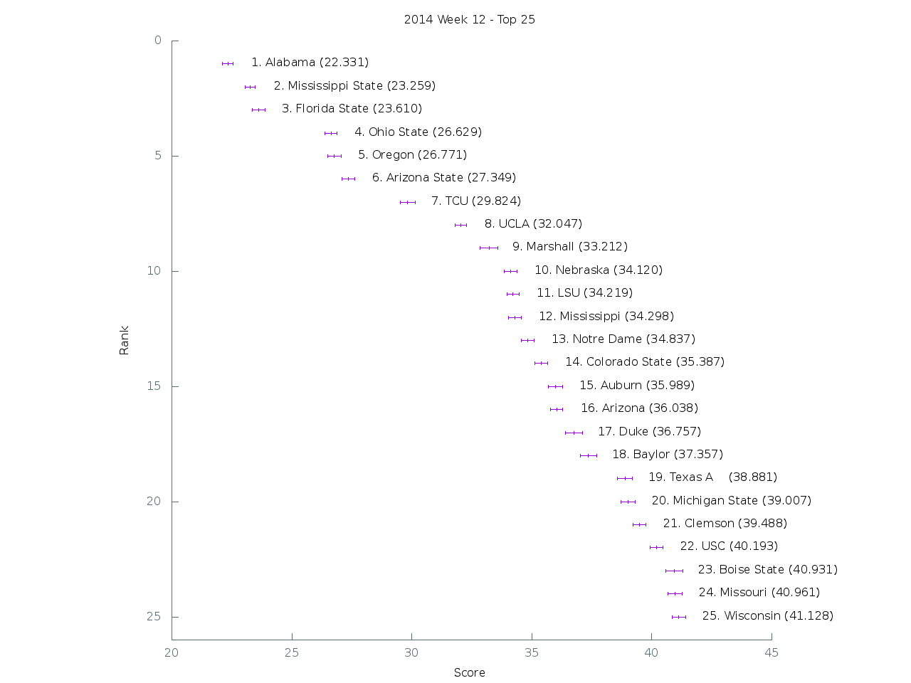

[Graph of all teams](img/week12.png)

 Rank | Team                           | Score      | Uncertainty
------|--------------------------------|------------|------------
    1 | Alabama                   |  22.330800 |   0.224569
    2 | Mississippi State         |  23.258900 |   0.202173
    3 | Florida State             |  23.610500 |   0.266927
    4 | Ohio State                |  26.628700 |   0.238623
    5 | Oregon                    |  26.770900 |   0.273090
    6 | Arizona State             |  27.349200 |   0.271247
    7 | TCU                       |  29.824400 |   0.306622
    8 | UCLA                      |  32.046600 |   0.243120
    9 | Marshall                  |  33.211900 |   0.358541
   10 | Nebraska                  |  34.119700 |   0.265612
   11 | LSU                       |  34.219500 |   0.244414
   12 | Mississippi               |  34.298000 |   0.265968
   13 | Notre Dame                |  34.836900 |   0.267272
   14 | Colorado State            |  35.387300 |   0.274555
   15 | Auburn                    |  35.989400 |   0.290997
   16 | Arizona                   |  36.038100 |   0.252597
   17 | Duke                      |  36.756600 |   0.354084
   18 | Baylor                    |  37.357300 |   0.336034
   19 | Texas A&M                 |  38.880600 |   0.317881
   20 | Michigan State            |  39.006600 |   0.298522
   21 | Clemson                   |  39.488000 |   0.265887
   22 | USC                       |  40.193200 |   0.259332
   23 | Boise State               |  40.930900 |   0.349360
   24 | Missouri                  |  40.960700 |   0.298370
   25 | Wisconsin                 |  41.127800 |   0.292971
   26 | Kansas State              |  41.746700 |   0.362611
   27 | Georgia                   |  42.800900 |   0.292073
   28 | Georgia Tech              |  44.023500 |   0.248399
   29 | Minnesota                 |  44.672800 |   0.280859
   30 | Georgia Southern          |  47.306900 |   0.301538
   31 | Oklahoma                  |  47.858000 |   0.349146
   32 | Maryland                  |  47.966500 |   0.255318
   33 | Utah State                |  48.021100 |   0.307417
   34 | Miami (Fla.)              |  48.147700 |   0.271872
   35 | Utah                      |  48.234100 |   0.272651
   36 | Air Force                 |  48.902800 |   0.394679
   37 | Louisville                |  48.964800 |   0.343570
   38 | Stanford                  |  50.167100 |   0.267318
   39 | Nevada                    |  50.430200 |   0.329129
   40 | Louisiana-Lafayette       |  50.451800 |   0.340876
   41 | West Virginia             |  50.986400 |   0.248296
   42 | Washington                |  51.077400 |   0.357504
   43 | Florida                   |  51.485000 |   0.243810
   44 | Cincinnati                |  53.011000 |   0.331370
   45 | Arkansas State            |  53.337600 |   0.282890
   46 | Memphis                   |  53.494600 |   0.301623
   47 | Northern Illinois         |  53.728200 |   0.359859
   48 | Boston College            |  55.059200 |   0.308491
   49 | Kentucky                  |  55.272700 |   0.252666
   50 | Rice                      |  55.285900 |   0.359561
   51 | Iowa                      |  55.830300 |   0.251743
   52 | Texas                     |  56.103700 |   0.336491
   53 | Rutgers                   |  56.298500 |   0.328907
   54 | East Carolina             |  56.646400 |   0.294548
   55 | Bowling Green             |  56.647200 |   0.342918
   56 | California                |  56.769400 |   0.235671
   57 | BYU                       |  56.959800 |   0.225599
   58 | Michigan                  |  57.679600 |   0.315983
   59 | UCF                       |  58.234800 |   0.310105
   60 | Penn State                |  58.712200 |   0.277741
   61 | Western Michigan          |  59.332300 |   0.393886
   62 | Middle Tennessee          |  59.343100 |   0.294775
   63 | Arkansas                  |  59.651900 |   0.413859
   64 | Temple                    |  61.117400 |   0.331698
   65 | Illinois                  |  62.018800 |   0.303038
   66 | Oklahoma State            |  62.087300 |   0.323409
   67 | North Carolina            |  62.163600 |   0.324324
   68 | Tennessee                 |  62.486600 |   0.305455
   69 | Houston                   |  62.793900 |   0.331165
   70 | North Carolina State      |  64.282200 |   0.306296
   71 | San Diego State           |  64.873600 |   0.371375
   72 | Texas State               |  65.167500 |   0.336330
   73 | South Alabama             |  65.304200 |   0.334292
   74 | Navy                      |  66.379000 |   0.420503
   75 | Ohio                      |  66.691400 |   0.283551
   76 | Virginia                  |  68.127000 |   0.403165
   77 | South Carolina            |  68.269400 |   0.329551
   78 | Virginia Tech             |  69.166100 |   0.301412
   79 | Pittsburgh                |  69.218900 |   0.379662
   80 | Oregon State              |  69.977000 |   0.291445
   81 | Wyoming                   |  70.847000 |   0.323942
   82 | Washington State          |  71.471100 |   0.246505
   83 | Central Michigan          |  71.552200 |   0.242218
   84 | Northwestern              |  71.596700 |   0.308504
   85 | Purdue                    |  73.010700 |   0.276946
   86 | Western Kentucky          |  73.414100 |   0.206493
   87 | Tulane                    |  73.458100 |   0.359667
   88 | UTEP                      |  73.496000 |   0.260825
   89 | Indiana                   |  75.117500 |   0.323046
   90 | Syracuse                  |  75.936600 |   0.373003
   91 | UAB                       |  76.225700 |   0.231239
   92 | Toledo                    |  76.494500 |   0.327841
   93 | Fresno State              |  76.960500 |   0.332099
   94 | New Mexico                |  77.212800 |   0.365794
   95 | Texas Tech                |  78.957100 |   0.351573
   96 | Vanderbilt                |  79.296900 |   0.349908
   97 | South Florida             |  79.738100 |   0.305654
   98 | Colorado                  |  79.810200 |   0.307922
   99 | Army                      |  80.189200 |   0.315600
  100 | North Texas               |  80.967800 |   0.297813
  101 | Old Dominion              |  84.085100 |   0.317448
  102 | Kansas                    |  84.192000 |   0.375142
  103 | Florida Atlantic          |  84.527900 |   0.242166
  104 | Buffalo                   |  84.829700 |   0.319703
  105 | San Jose State            |  84.930400 |   0.410284
  106 | Wake Forest               |  85.080100 |   0.337845
  107 | Louisiana-Monroe          |  85.305800 |   0.249420
  108 | Connecticut               |  85.983000 |   0.326142
  109 | Hawaii                    |  86.003900 |   0.295285
  110 | Akron                     |  87.097200 |   0.273296
  111 | Louisiana Tech            |  87.807100 |   0.122057
  112 | Tulsa                     |  88.457800 |   0.294178
  113 | UTSA                      |  90.350700 |   0.226656
  114 | Eastern Michigan          |  90.821300 |   0.272485
  115 | UNLV                      |  90.911400 |   0.253038
  116 | Southern Miss             |  91.634300 |   0.253611
  117 | Massachusetts             |  92.015700 |   0.274143
  118 | Idaho                     |  92.318000 |   0.328163
  119 | SMU                       |  97.178300 |   0.285254
  120 | Kent State                | 100.130000 |   0.199253
  121 | New Mexico State          | 100.564400 |   0.189081
  122 | Georgia State             | 107.458400 |   0.154064
  123 | Ball State                | 107.632700 |   0.099639
  124 | Appalachian State         | 108.050100 |   0.070064
  125 | Florida International     | 116.805700 |   0.085181
  126 | Iowa State                | 116.994500 |   0.074302
  127 | Miami (Ohio)              | 117.098900 |   0.077522
  128 | Troy                      | 118.594300 |   0.049105
