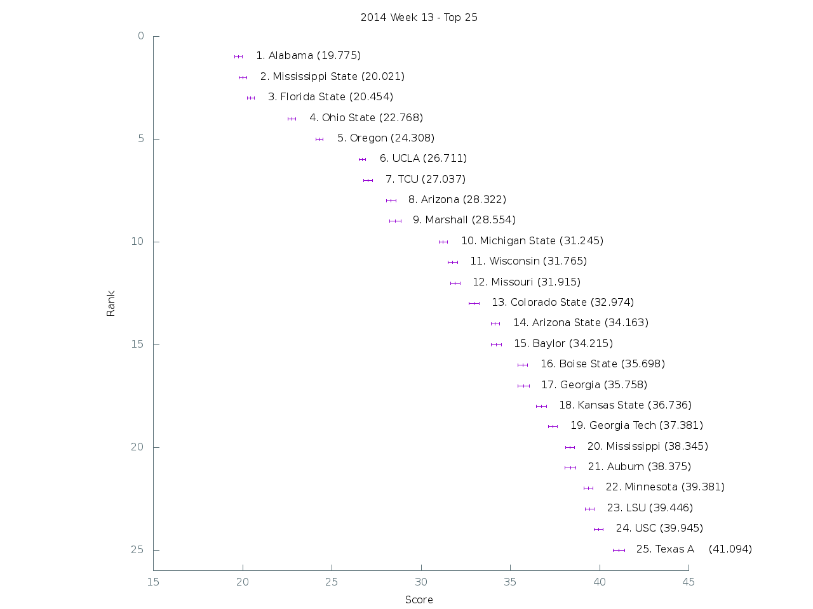

[Graph of all teams](img/week13.png)

 Rank | Team                           | Score      | Uncertainty
------|--------------------------------|------------|------------
    1 | Alabama                   |  19.775200 |   0.215987
    2 | Mississippi State         |  20.020700 |   0.208631
    3 | Florida State             |  20.454100 |   0.204487
    4 | Ohio State                |  22.768000 |   0.218594
    5 | Oregon                    |  24.308300 |   0.210850
    6 | UCLA                      |  26.710600 |   0.190541
    7 | TCU                       |  27.036700 |   0.254778
    8 | Arizona                   |  28.321800 |   0.263132
    9 | Marshall                  |  28.554200 |   0.332767
   10 | Michigan State            |  31.245200 |   0.235661
   11 | Wisconsin                 |  31.765300 |   0.268114
   12 | Missouri                  |  31.915200 |   0.274844
   13 | Colorado State            |  32.974000 |   0.277190
   14 | Arizona State             |  34.162600 |   0.227611
   15 | Baylor                    |  34.215200 |   0.297464
   16 | Boise State               |  35.697700 |   0.262097
   17 | Georgia                   |  35.758000 |   0.325227
   18 | Kansas State              |  36.735600 |   0.281253
   19 | Georgia Tech              |  37.380600 |   0.256114
   20 | Mississippi               |  38.345400 |   0.254272
   21 | Auburn                    |  38.374700 |   0.305001
   22 | Minnesota                 |  39.381200 |   0.262339
   23 | LSU                       |  39.446300 |   0.235758
   24 | USC                       |  39.945200 |   0.257860
   25 | Texas A&M                 |  41.093600 |   0.326373
   26 | Nebraska                  |  41.835100 |   0.253322
   27 | Arkansas                  |  42.592700 |   0.272757
   28 | Clemson                   |  42.667700 |   0.344262
   29 | Louisville                |  42.876900 |   0.341185
   30 | Oklahoma                  |  42.998100 |   0.314608
   31 | Utah State                |  43.929200 |   0.303734
   32 | Utah                      |  44.355400 |   0.245109
   33 | Maryland                  |  46.175000 |   0.305915
   34 | Notre Dame                |  47.436800 |   0.268676
   35 | Washington                |  48.670500 |   0.283745
   36 | Memphis                   |  49.062200 |   0.321123
   37 | Stanford                  |  49.302900 |   0.253496
   38 | Northern Illinois         |  49.805600 |   0.382832
   39 | Duke                      |  50.254000 |   0.289102
   40 | Air Force                 |  50.442800 |   0.278389
   41 | Texas                     |  51.086700 |   0.275714
   42 | Cincinnati                |  51.661500 |   0.381864
   43 | North Carolina            |  52.279300 |   0.287864
   44 | West Virginia             |  52.508200 |   0.276265
   45 | Iowa                      |  52.789000 |   0.297062
   46 | Georgia Southern          |  53.738300 |   0.338546
   47 | East Carolina             |  54.052300 |   0.280573
   48 | BYU                       |  54.679700 |   0.334970
   49 | Miami (Fla.)              |  54.791000 |   0.323261
   50 | Rice                      |  54.898900 |   0.305070
   51 | Rutgers                   |  54.995300 |   0.335868
   52 | Western Michigan          |  55.094500 |   0.393782
   53 | South Carolina            |  55.499700 |   0.340242
   54 | Boston College            |  55.557300 |   0.349690
   55 | UCF                       |  56.619900 |   0.325906
   56 | Northwestern              |  57.388100 |   0.304507
   57 | Tennessee                 |  57.930600 |   0.343143
   58 | Florida                   |  58.020700 |   0.403127
   59 | Navy                      |  58.899700 |   0.373393
   60 | Penn State                |  59.274900 |   0.244759
   61 | San Diego State           |  59.427700 |   0.326050
   62 | Illinois                  |  59.809800 |   0.289225
   63 | California                |  59.949900 |   0.328561
   64 | Virginia                  |  60.108800 |   0.326869
   65 | Michigan                  |  60.397700 |   0.328047
   66 | Louisiana-Lafayette       |  60.463400 |   0.214386
   67 | Kentucky                  |  60.505400 |   0.300683
   68 | Oregon State              |  61.345700 |   0.265575
   69 | Houston                   |  61.477300 |   0.392835
   70 | North Carolina State      |  62.281200 |   0.363888
   71 | Nevada                    |  62.459700 |   0.287718
   72 | Bowling Green             |  65.329300 |   0.389499
   73 | Texas State               |  65.505200 |   0.279322
   74 | South Alabama             |  66.160100 |   0.328846
   75 | Temple                    |  66.378900 |   0.380952
   76 | Oklahoma State            |  67.393300 |   0.316641
   77 | Virginia Tech             |  68.857300 |   0.234748
   78 | Pittsburgh                |  69.506300 |   0.295837
   79 | Western Kentucky          |  69.962000 |   0.282092
   80 | Fresno State              |  70.603900 |   0.288202
   81 | Toledo                    |  70.867700 |   0.314995
   82 | Arkansas State            |  71.193900 |   0.235217
   83 | Ohio                      |  71.264600 |   0.266880
   84 | Middle Tennessee          |  71.839000 |   0.234801
   85 | Wyoming                   |  73.355800 |   0.244489
   86 | Washington State          |  73.856300 |   0.336035
   87 | UTEP                      |  74.206800 |   0.248519
   88 | Central Michigan          |  75.267800 |   0.269910
   89 | Purdue                    |  76.862900 |   0.306522
   90 | UAB                       |  78.472400 |   0.293619
   91 | Indiana                   |  78.873300 |   0.367415
   92 | Wake Forest               |  79.727100 |   0.328869
   93 | South Florida             |  80.503300 |   0.363049
   94 | Colorado                  |  80.567200 |   0.307823
   95 | Tulane                    |  80.584000 |   0.293151
   96 | Syracuse                  |  81.025500 |   0.323194
   97 | New Mexico                |  81.161100 |   0.337867
   98 | Texas Tech                |  81.324900 |   0.327992
   99 | Vanderbilt                |  81.677900 |   0.301451
  100 | Old Dominion              |  82.651500 |   0.260033
  101 | Hawaii                    |  83.171100 |   0.251198
  102 | Army                      |  84.902800 |   0.322126
  103 | Appalachian State         |  85.192900 |   0.121732
  104 | North Texas               |  85.548300 |   0.272767
  105 | Kansas                    |  86.037800 |   0.287414
  106 | Louisiana-Monroe          |  86.210400 |   0.300914
  107 | Buffalo                   |  86.493600 |   0.280404
  108 | Akron                     |  86.543900 |   0.288509
  109 | Connecticut               |  89.452800 |   0.304734
  110 | Florida Atlantic          |  89.776500 |   0.256586
  111 | San Jose State            |  92.028900 |   0.250131
  112 | Tulsa                     |  92.111300 |   0.295561
  113 | UNLV                      |  94.468400 |   0.280817
  114 | Southern Miss             |  94.483400 |   0.244668
  115 | UTSA                      |  94.629100 |   0.247358
  116 | Louisiana Tech            |  94.660000 |   0.156565
  117 | Massachusetts             |  98.495400 |   0.234364
  118 | Eastern Michigan          |  99.960900 |   0.273347
  119 | Idaho                     | 101.441500 |   0.208197
  120 | SMU                       | 102.484700 |   0.255307
  121 | Kent State                | 103.761800 |   0.200951
  122 | New Mexico State          | 104.569300 |   0.207960
  123 | Ball State                | 106.432600 |   0.121959
  124 | Florida International     | 106.878600 |   0.095912
  125 | Georgia State             | 109.980800 |   0.156443
  126 | Troy                      | 114.426500 |   0.077528
  127 | Iowa State                | 119.958500 |   0.059568
  128 | Miami (Ohio)              | 120.136400 |   0.049569
