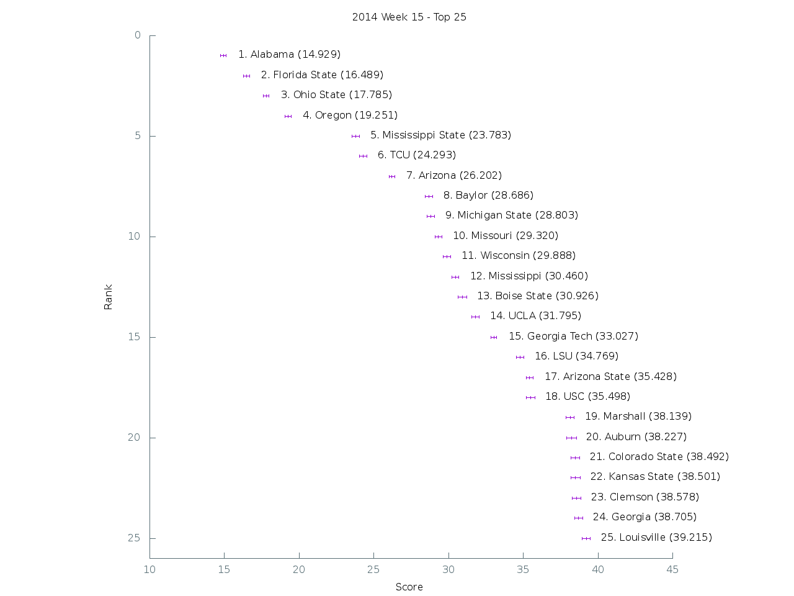

[Graph of all teams](img/week15.png)

 Rank | Team                           | Score      | Uncertainty
------|--------------------------------|------------|------------
    1 | Alabama                   |  14.928800 |   0.187157
    2 | Florida State             |  16.489500 |   0.202135
    3 | Ohio State                |  17.784900 |   0.195264
    4 | Oregon                    |  19.251000 |   0.204554
    5 | Mississippi State         |  23.782700 |   0.238203
    6 | TCU                       |  24.292900 |   0.247015
    7 | Arizona                   |  26.201700 |   0.187623
    8 | Baylor                    |  28.686000 |   0.266552
    9 | Michigan State            |  28.803100 |   0.246750
   10 | Missouri                  |  29.319700 |   0.232692
   11 | Wisconsin                 |  29.887600 |   0.235860
   12 | Mississippi               |  30.460100 |   0.236367
   13 | Boise State               |  30.926200 |   0.305035
   14 | UCLA                      |  31.795000 |   0.261427
   15 | Georgia Tech              |  33.026900 |   0.191876
   16 | LSU                       |  34.769200 |   0.249466
   17 | Arizona State             |  35.428400 |   0.224421
   18 | USC                       |  35.498000 |   0.279233
   19 | Marshall                  |  38.139200 |   0.275958
   20 | Auburn                    |  38.227500 |   0.339178
   21 | Colorado State            |  38.491700 |   0.280658
   22 | Kansas State              |  38.500800 |   0.304556
   23 | Clemson                   |  38.577700 |   0.284855
   24 | Georgia                   |  38.704500 |   0.260651
   25 | Louisville                |  39.214500 |   0.257850
   26 | Nebraska                  |  40.782500 |   0.267494
   27 | Minnesota                 |  40.933200 |   0.247279
   28 | Stanford                  |  41.053600 |   0.268582
   29 | Utah                      |  42.092000 |   0.355600
   30 | Air Force                 |  42.618900 |   0.304020
   31 | Texas A&M                 |  43.318900 |   0.314400
   32 | Northern Illinois         |  43.463300 |   0.279514
   33 | Arkansas                  |  44.531300 |   0.309034
   34 | Cincinnati                |  44.637400 |   0.304222
   35 | Utah State                |  45.556100 |   0.299680
   36 | Washington                |  46.379200 |   0.309168
   37 | Memphis                   |  47.326100 |   0.312034
   38 | Duke                      |  47.942000 |   0.247920
   39 | UCF                       |  48.960700 |   0.321469
   40 | Rutgers                   |  49.192800 |   0.348606
   41 | Notre Dame                |  49.571100 |   0.238765
   42 | BYU                       |  49.877200 |   0.338328
   43 | Oklahoma                  |  50.182300 |   0.294823
   44 | Maryland                  |  50.206600 |   0.300967
   45 | West Virginia             |  51.720400 |   0.264976
   46 | Texas                     |  52.140400 |   0.349412
   47 | Iowa                      |  52.294000 |   0.257724
   48 | Georgia Southern          |  52.906000 |   0.318322
   49 | Boston College            |  53.663500 |   0.353287
   50 | Navy                      |  54.684200 |   0.349943
   51 | Tennessee                 |  55.524000 |   0.318235
   52 | Illinois                  |  55.579000 |   0.223412
   53 | North Carolina State      |  56.301600 |   0.298029
   54 | East Carolina             |  56.553200 |   0.318286
   55 | North Carolina            |  57.194300 |   0.255683
   56 | San Diego State           |  58.343800 |   0.351391
   57 | Western Kentucky          |  58.366600 |   0.229487
   58 | South Carolina            |  58.432400 |   0.354977
   59 | Florida                   |  58.564400 |   0.337467
   60 | Oklahoma State            |  59.021500 |   0.354177
   61 | Western Michigan          |  59.036400 |   0.332687
   62 | Louisiana-Lafayette       |  60.151900 |   0.228780
   63 | Penn State                |  61.119100 |   0.309511
   64 | Michigan                  |  61.181400 |   0.318297
   65 | Miami (Fla.)              |  61.569500 |   0.223392
   66 | Northwestern              |  61.813600 |   0.243106
   67 | Nevada                    |  62.138300 |   0.320825
   68 | Pittsburgh                |  62.860400 |   0.316873
   69 | Oregon State              |  63.033700 |   0.310109
   70 | Kentucky                  |  63.454000 |   0.298655
   71 | Virginia Tech             |  63.578500 |   0.267485
   72 | Houston                   |  63.713900 |   0.333740
   73 | California                |  64.825300 |   0.338384
   74 | Rice                      |  65.181200 |   0.270333
   75 | Virginia                  |  65.650700 |   0.277062
   76 | Texas State               |  66.029500 |   0.265507
   77 | Temple                    |  66.094000 |   0.288143
   78 | Fresno State              |  68.937700 |   0.234333
   79 | South Alabama             |  69.319300 |   0.316270
   80 | Toledo                    |  69.575300 |   0.307621
   81 | Arkansas State            |  70.972000 |   0.270395
   82 | UTEP                      |  70.994300 |   0.262897
   83 | Ohio                      |  71.950100 |   0.368456
   84 | Indiana                   |  74.481500 |   0.298231
   85 | New Mexico                |  76.448500 |   0.323565
   86 | Washington State          |  76.525900 |   0.318732
   87 | Middle Tennessee          |  76.718200 |   0.244493
   88 | Central Michigan          |  76.825200 |   0.290370
   89 | Bowling Green             |  77.286300 |   0.282907
   90 | UAB                       |  77.786900 |   0.289778
   91 | Wyoming                   |  79.159900 |   0.316903
   92 | Old Dominion              |  81.067900 |   0.330558
   93 | Wake Forest               |  82.320100 |   0.281358
   94 | Purdue                    |  82.604400 |   0.321790
   95 | South Florida             |  83.564500 |   0.309185
   96 | Texas Tech                |  83.585700 |   0.341988
   97 | Syracuse                  |  84.004500 |   0.322059
   98 | Tulane                    |  84.038400 |   0.288309
   99 | Colorado                  |  84.103200 |   0.347265
  100 | Vanderbilt                |  84.642400 |   0.284019
  101 | Hawaii                    |  84.702100 |   0.280132
  102 | Buffalo                   |  85.846600 |   0.302325
  103 | Louisiana Tech            |  85.919300 |   0.170043
  104 | Army                      |  85.965500 |   0.329140
  105 | Appalachian State         |  85.989600 |   0.129765
  106 | Kansas                    |  87.520100 |   0.359527
  107 | Louisiana-Monroe          |  88.954200 |   0.230909
  108 | UTSA                      |  91.374300 |   0.234522
  109 | North Texas               |  91.453400 |   0.294000
  110 | Florida Atlantic          |  93.549100 |   0.274202
  111 | Akron                     |  93.745500 |   0.224611
  112 | San Jose State            |  94.264800 |   0.298307
  113 | Tulsa                     |  94.688600 |   0.269219
  114 | Connecticut               |  96.831600 |   0.234430
  115 | Southern Miss             |  97.930500 |   0.225891
  116 | Ball State                |  98.003200 |   0.131578
  117 | SMU                       |  98.530400 |   0.215748
  118 | Kent State                |  98.992300 |   0.198749
  119 | UNLV                      |  99.413700 |   0.216659
  120 | Massachusetts             | 102.416400 |   0.177957
  121 | Eastern Michigan          | 102.605600 |   0.225266
  122 | Idaho                     | 104.052600 |   0.215660
  123 | New Mexico State          | 106.816300 |   0.261836
  124 | Florida International     | 109.207700 |   0.096549
  125 | Georgia State             | 111.743000 |   0.137643
  126 | Troy                      | 116.199300 |   0.070838
  127 | Iowa State                | 120.808500 |   0.058475
  128 | Miami (Ohio)              | 121.030100 |   0.057510
