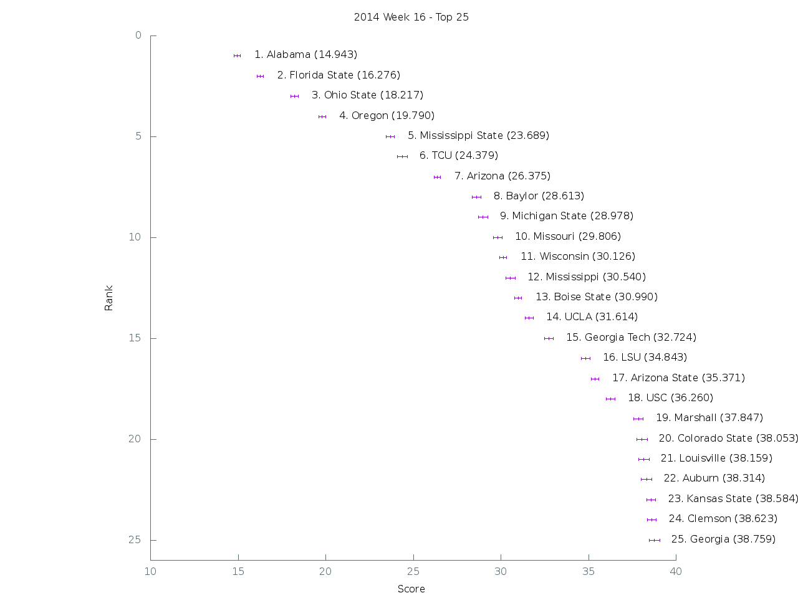

[Graph of all teams](img/week16.png)

 Rank | Team                           | Score      | Uncertainty
------|--------------------------------|------------|------------
    1 |  Alabama                   |  14.942700 |   0.172539
    2 |  Florida State             |  16.276300 |   0.175531
    3 |  Ohio State                |  18.217400 |   0.202440
    4 |  Oregon                    |  19.789900 |   0.197218
    5 |  Mississippi State         |  23.688800 |   0.231234
    6 |  TCU                       |  24.378600 |   0.286378
    7 |  Arizona                   |  26.375100 |   0.179427
    8 |  Baylor                    |  28.613500 |   0.251524
    9 |  Michigan State            |  28.978000 |   0.260461
   10 |  Missouri                  |  29.805800 |   0.248657
   11 |  Wisconsin                 |  30.125800 |   0.204477
   12 |  Mississippi               |  30.540200 |   0.264175
   13 |  Boise State               |  30.990400 |   0.199102
   14 |  UCLA                      |  31.613900 |   0.229033
   15 |  Georgia Tech              |  32.724500 |   0.250474
   16 |  LSU                       |  34.842900 |   0.238220
   17 |  Arizona State             |  35.370700 |   0.219775
   18 |  USC                       |  36.260000 |   0.260670
   19 |  Marshall                  |  37.846900 |   0.276889
   20 |  Colorado State            |  38.052700 |   0.303429
   21 |  Louisville                |  38.159300 |   0.309574
   22 |  Auburn                    |  38.314400 |   0.306494
   23 |  Kansas State              |  38.584000 |   0.240102
   24 |  Clemson                   |  38.623000 |   0.250360
   25 |  Georgia                   |  38.758600 |   0.299727
   26 |  Nebraska                  |  40.650700 |   0.237684
   27 |  Stanford                  |  40.853700 |   0.315957
   28 |  Minnesota                 |  41.712400 |   0.245563
   29 |  Utah                      |  42.119100 |   0.335963
   30 |  Air Force                 |  42.460700 |   0.258434
   31 |  Texas A&M                 |  43.695600 |   0.279326
   32 |  Northern Illinois         |  43.753000 |   0.353654
   33 |  Cincinnati                |  44.814000 |   0.290320
   34 |  Arkansas                  |  45.075200 |   0.256758
   35 |  Utah State                |  45.982400 |   0.323706
   36 |  Washington                |  46.278800 |   0.299631
   37 |  Memphis                   |  47.081000 |   0.296143
   38 |  Duke                      |  47.651600 |   0.317630
   39 |  UCF                       |  49.054300 |   0.251266
   40 |  Rutgers                   |  49.080700 |   0.292386
   41 |  Notre Dame                |  49.448600 |   0.232664
   42 |  BYU                       |  49.851600 |   0.303395
   43 |  Oklahoma                  |  50.253000 |   0.339640
   44 |  Maryland                  |  50.585800 |   0.286106
   45 |  West Virginia             |  51.556100 |   0.346745
   46 |  Georgia Southern          |  51.608500 |   0.363850
   47 |  Texas                     |  52.190200 |   0.315612
   48 |  Iowa                      |  52.778000 |   0.337746
   49 |  Boston College            |  53.537200 |   0.344453
   50 |  Navy                      |  54.749300 |   0.305028
   51 |  North Carolina State      |  55.428900 |   0.275414
   52 |  Tennessee                 |  55.702900 |   0.334791
   53 |  Illinois                  |  56.113100 |   0.254295
   54 |  East Carolina             |  56.605800 |   0.264418
   55 |  North Carolina            |  57.124500 |   0.298117
   56 |  San Diego State           |  57.837700 |   0.335049
   57 |  Western Kentucky          |  58.595500 |   0.213758
   58 |  South Carolina            |  58.645400 |   0.297245
   59 |  Florida                   |  58.805200 |   0.382781
   60 |  Oklahoma State            |  58.830100 |   0.357507
   61 |  Western Michigan          |  59.377600 |   0.386201
   62 |  Louisiana-Lafayette       |  60.107200 |   0.291878
   63 |  Penn State                |  61.037000 |   0.215649
   64 | .png) Miami (Fla.)              |  61.269000 |   0.310358
   65 |  Northwestern              |  61.958900 |   0.253441
   66 |  Nevada                    |  62.080200 |   0.342023
   67 |  Michigan                  |  62.179100 |   0.277896
   68 |  Oregon State              |  62.713300 |   0.342257
   69 |  Pittsburgh                |  62.866600 |   0.329497
   70 |  Kentucky                  |  63.042100 |   0.331411
   71 |  Houston                   |  63.252500 |   0.331596
   72 |  Virginia Tech             |  63.453100 |   0.291013
   73 |  California                |  64.888900 |   0.334810
   74 |  Rice                      |  65.070400 |   0.308055
   75 |  Virginia                  |  65.202100 |   0.342294
   76 |  Texas State               |  65.559900 |   0.303559
   77 |  Temple                    |  66.026300 |   0.325997
   78 |  South Alabama             |  69.386500 |   0.264091
   79 |  Fresno State              |  69.460000 |   0.299200
   80 |  Toledo                    |  70.807600 |   0.300325
   81 |  Arkansas State            |  70.817100 |   0.384359
   82 |  UTEP                      |  71.100100 |   0.222971
   83 |  Ohio                      |  71.348800 |   0.383455
   84 |  Indiana                   |  75.162500 |   0.312375
   85 |  New Mexico                |  76.516700 |   0.306013
   86 |  Middle Tennessee          |  76.565500 |   0.242575
   87 |  Central Michigan          |  76.580300 |   0.219127
   88 |  Washington State          |  77.088400 |   0.368004
   89 |  Bowling Green             |  77.410400 |   0.245090
   90 |  UAB                       |  77.883200 |   0.259711
   91 |  Wyoming                   |  79.097300 |   0.321702
   92 |  Old Dominion              |  81.069700 |   0.258397
   93 |  Wake Forest               |  81.704300 |   0.274625
   94 |  Purdue                    |  83.145800 |   0.319771
   95 |  South Florida             |  83.246600 |   0.326338
   96 |  Texas Tech                |  83.291900 |   0.351127
   97 |  Colorado                  |  83.507300 |   0.324472
   98 |  Tulane                    |  83.649200 |   0.342379
   99 |  Syracuse                  |  83.673700 |   0.338713
  100 |  Hawaii                    |  84.244600 |   0.311659
  101 |  Vanderbilt                |  84.259600 |   0.383101
  102 |  Buffalo                   |  85.003800 |   0.298695
  103 |  Army                      |  85.773000 |   0.284981
  104 |  Appalachian State         |  85.835100 |   0.190361
  105 |  Louisiana Tech            |  85.878700 |   0.150969
  106 |  Kansas                    |  88.006100 |   0.344915
  107 |  Louisiana-Monroe          |  88.423800 |   0.259153
  108 |  UTSA                      |  91.364600 |   0.219976
  109 |  North Texas               |  91.768500 |   0.270792
  110 |  Akron                     |  93.749300 |   0.249233
  111 |  Florida Atlantic          |  94.102300 |   0.264641
  112 |  San Jose State            |  94.549900 |   0.287069
  113 |  Tulsa                     |  94.781500 |   0.230737
  114 |  Connecticut               |  96.545700 |   0.189535
  115 |  Southern Miss             |  97.697900 |   0.221890
  116 |  Ball State                |  98.123800 |   0.125233
  117 |  SMU                       |  98.547400 |   0.207568
  118 |  Kent State                |  99.590600 |   0.210153
  119 |  UNLV                      |  99.600300 |   0.266077
  120 |  Eastern Michigan          | 102.708100 |   0.222476
  121 |  Massachusetts             | 102.770500 |   0.184528
  122 |  Idaho                     | 103.639000 |   0.210583
  123 |  New Mexico State          | 106.828900 |   0.216954
  124 |  Florida International     | 109.214000 |   0.092269
  125 |  Georgia State             | 111.784900 |   0.171730
  126 |  Troy                      | 116.108200 |   0.084798
  127 |  Iowa State                | 120.973800 |   0.051710
  128 | .png) Miami (Ohio)              | 121.145000 |   0.046415
