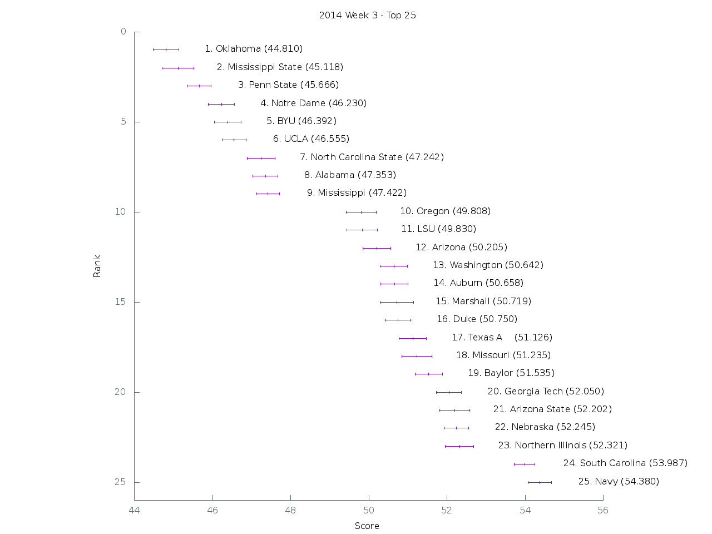

[Graph of all teams](img/week3.png)

 Rank | Team                           | Score      | Uncertainty
------|--------------------------------|------------|------------
    1 | Oklahoma                  |  44.810400 |   0.331626
    2 | Mississippi State         |  45.118400 |   0.400272
    3 | Penn State                |  45.666300 |   0.303724
    4 | Notre Dame                |  46.230000 |   0.337306
    5 | BYU                       |  46.392500 |   0.346342
    6 | UCLA                      |  46.555400 |   0.312162
    7 | North Carolina State      |  47.241600 |   0.352856
    8 | Alabama                   |  47.353100 |   0.315534
    9 | Mississippi               |  47.422000 |   0.286707
   10 | Oregon                    |  49.808000 |   0.382104
   11 | LSU                       |  49.830400 |   0.395904
   12 | Arizona                   |  50.205400 |   0.352294
   13 | Washington                |  50.641900 |   0.350123
   14 | Auburn                    |  50.658200 |   0.350591
   15 | Marshall                  |  50.718600 |   0.420671
   16 | Duke                      |  50.749600 |   0.325603
   17 | Texas A&M                 |  51.125600 |   0.349939
   18 | Missouri                  |  51.235400 |   0.386078
   19 | Baylor                    |  51.534700 |   0.346298
   20 | Georgia Tech              |  52.050200 |   0.325262
   21 | Arizona State             |  52.201500 |   0.387870
   22 | Nebraska                  |  52.245300 |   0.314775
   23 | Northern Illinois         |  52.321200 |   0.368725
   24 | South Carolina            |  53.986600 |   0.258099
   25 | Navy                      |  54.380100 |   0.295697
   26 | Boston College            |  54.638600 |   0.344115
   27 | TCU                       |  54.755800 |   0.337329
   28 | Pittsburgh                |  54.992900 |   0.312037
   29 | Tennessee                 |  55.140000 |   0.349217
   30 | Boise State               |  55.163000 |   0.305719
   31 | Florida                   |  55.195300 |   0.397821
   32 | Syracuse                  |  55.297000 |   0.358072
   33 | UTEP                      |  55.332200 |   0.308067
   34 | Kentucky                  |  55.440900 |   0.375254
   35 | California                |  55.534500 |   0.428986
   36 | North Carolina            |  55.716700 |   0.328282
   37 | Florida State             |  55.784700 |   0.407853
   38 | Louisiana Tech            |  55.796500 |   0.310578
   39 | Louisiana-Monroe          |  56.037500 |   0.365951
   40 | Oregon State              |  56.161600 |   0.351526
   41 | USC                       |  56.367100 |   0.322939
   42 | Nevada                    |  56.397200 |   0.361300
   43 | Utah                      |  56.690200 |   0.371917
   44 | Cincinnati                |  56.915800 |   0.361615
   45 | Ohio State                |  58.086100 |   0.260200
   46 | Stanford                  |  58.784800 |   0.393721
   47 | Bowling Green             |  59.533300 |   0.308717
   48 | East Carolina             |  59.713500 |   0.325737
   49 | Virginia                  |  59.783200 |   0.329001
   50 | West Virginia             |  59.869800 |   0.347857
   51 | Arkansas                  |  60.208900 |   0.340498
   52 | South Alabama             |  60.276800 |   0.357955
   53 | Wyoming                   |  60.548000 |   0.321912
   54 | Michigan                  |  60.552400 |   0.375171
   55 | Rutgers                   |  60.615000 |   0.347127
   56 | Illinois                  |  60.641400 |   0.311133
   57 | Oklahoma State            |  60.721200 |   0.315676
   58 | Central Michigan          |  60.765600 |   0.410377
   59 | Middle Tennessee          |  60.869500 |   0.331839
   60 | Miami (Fla.)              |  60.937800 |   0.393906
   61 | Georgia                   |  61.017500 |   0.366295
   62 | Old Dominion              |  61.370200 |   0.324311
   63 | Air Force                 |  61.407100 |   0.316881
   64 | UAB                       |  61.446500 |   0.324431
   65 | Western Michigan          |  61.670500 |   0.322109
   66 | Utah State                |  61.826000 |   0.364667
   67 | Minnesota                 |  61.978100 |   0.333986
   68 | Texas Tech                |  61.988000 |   0.333810
   69 | New Mexico State          |  62.048900 |   0.343278
   70 | Temple                    |  62.082800 |   0.305760
   71 | Kansas State              |  62.093400 |   0.404916
   72 | Army                      |  62.126100 |   0.399281
   73 | Virginia Tech             |  62.197300 |   0.286680
   74 | Louisville                |  62.324400 |   0.342380
   75 | Maryland                  |  62.439200 |   0.341972
   76 | Colorado State            |  62.604400 |   0.381794
   77 | Florida Atlantic          |  63.948600 |   0.271088
   78 | Texas                     |  64.217000 |   0.294455
   79 | Purdue                    |  65.431200 |   0.301164
   80 | Kansas                    |  65.644000 |   0.343576
   81 | San Jose State            |  65.814700 |   0.416244
   82 | Vanderbilt                |  65.886000 |   0.263226
   83 | Ohio                      |  66.073200 |   0.308652
   84 | Memphis                   |  66.185700 |   0.310405
   85 | Akron                     |  66.373400 |   0.393415
   86 | UTSA                      |  66.449400 |   0.326972
   87 | Texas State               |  66.489200 |   0.404514
   88 | Clemson                   |  66.489600 |   0.380482
   89 | San Diego State           |  66.499000 |   0.311607
   90 | North Texas               |  66.547400 |   0.316027
   91 | Colorado                  |  66.718900 |   0.318476
   92 | Appalachian State         |  66.730300 |   0.393244
   93 | Wisconsin                 |  66.967900 |   0.394451
   94 | Tulsa                     |  66.981200 |   0.302026
   95 | Michigan State            |  67.243800 |   0.365807
   96 | Indiana                   |  67.308500 |   0.393764
   97 | Western Kentucky          |  67.768400 |   0.337586
   98 | Houston                   |  69.852100 |   0.351681
   99 | South Florida             |  70.131100 |   0.351013
  100 | Southern Miss             |  70.265900 |   0.357718
  101 | Connecticut               |  70.733400 |   0.304568
  102 | Louisiana-Lafayette       |  70.962500 |   0.378806
  103 | Rice                      |  71.033500 |   0.342676
  104 | UCF                       |  71.195200 |   0.371462
  105 | Buffalo                   |  71.278000 |   0.352222
  106 | UNLV                      |  71.442000 |   0.407273
  107 | Georgia Southern          |  71.474500 |   0.310776
  108 | Washington State          |  71.551600 |   0.362449
  109 | Iowa                      |  71.703600 |   0.300180
  110 | Idaho                     |  71.781700 |   0.263460
  111 | Northwestern              |  71.817100 |   0.346332
  112 | Georgia State             |  71.955500 |   0.293031
  113 | Arkansas State            |  72.000300 |   0.346370
  114 | Hawaii                    |  72.003600 |   0.432510
  115 | New Mexico                |  72.262800 |   0.354193
  116 | Tulane                    |  72.434200 |   0.304432
  117 | Wake Forest               |  72.531700 |   0.363134
  118 | Toledo                    |  72.700700 |   0.381155
  119 | Eastern Michigan          |  72.829700 |   0.294064
  120 | SMU                       |  73.236900 |   0.354762
  121 | Fresno State              |  75.364000 |   0.336463
  122 | Kent State                |  75.667300 |   0.251734
  123 | Massachusetts             |  77.312900 |   0.332729
  124 | Iowa State                | 108.343200 |   0.078462
  125 | Florida International     | 124.000000 |   0.000000
  126 | Miami (Ohio)              | 125.000000 |   0.000000
  127 | Ball State                | 126.000000 |   0.000000
  128 | Troy                      | 127.000000 |   0.000000
