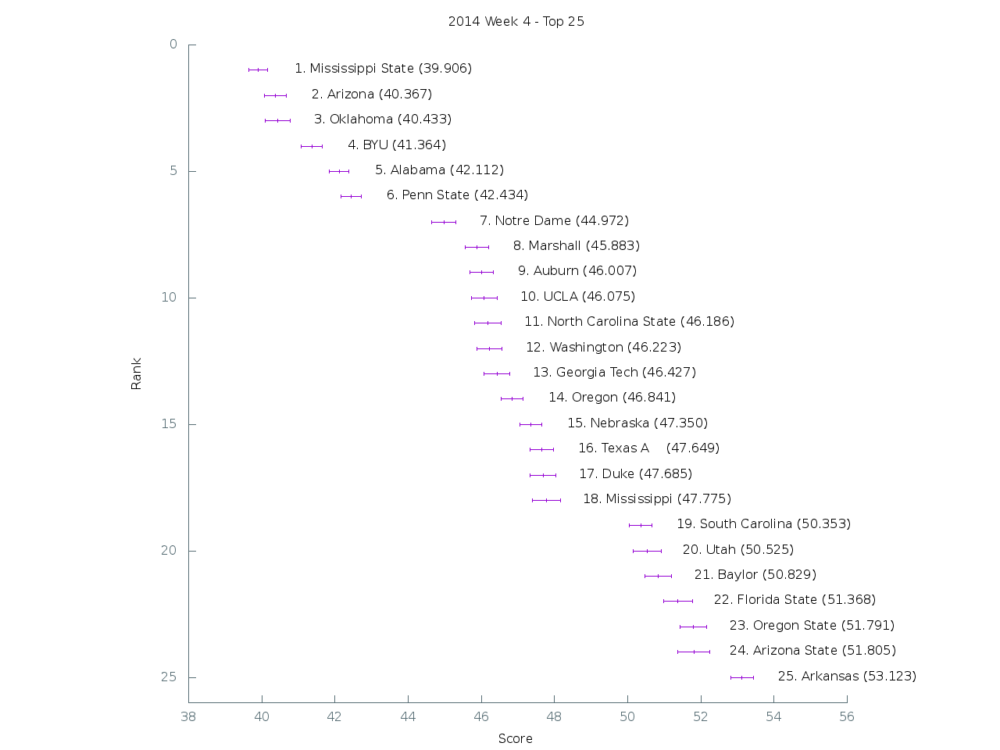

[Graph of all teams](img/week4.png)

 Rank | Team                           | Score      | Uncertainty
------|--------------------------------|------------|------------
    1 | Mississippi State         |  39.905900 |   0.254259
    2 | Arizona                   |  40.366900 |   0.302038
    3 | Oklahoma                  |  40.433100 |   0.346413
    4 | BYU                       |  41.364300 |   0.282172
    5 | Alabama                   |  42.112500 |   0.265759
    6 | Penn State                |  42.433500 |   0.276848
    7 | Notre Dame                |  44.972200 |   0.323133
    8 | Marshall                  |  45.882500 |   0.322977
    9 | Auburn                    |  46.006900 |   0.322420
   10 | UCLA                      |  46.074600 |   0.350654
   11 | North Carolina State      |  46.186200 |   0.361072
   12 | Washington                |  46.223200 |   0.342584
   13 | Georgia Tech              |  46.427100 |   0.348052
   14 | Oregon                    |  46.841400 |   0.300063
   15 | Nebraska                  |  47.350000 |   0.306142
   16 | Texas A&M                 |  47.648700 |   0.322162
   17 | Duke                      |  47.685400 |   0.354476
   18 | Mississippi               |  47.774500 |   0.380185
   19 | South Carolina            |  50.353200 |   0.304046
   20 | Utah                      |  50.525200 |   0.383180
   21 | Baylor                    |  50.828800 |   0.367577
   22 | Florida State             |  51.367900 |   0.394830
   23 | Oregon State              |  51.790500 |   0.358390
   24 | Arizona State             |  51.805300 |   0.428205
   25 | Arkansas                  |  53.123200 |   0.310654
   26 | Rutgers                   |  53.368300 |   0.295571
   27 | LSU                       |  53.415100 |   0.313187
   28 | East Carolina             |  53.659900 |   0.301960
   29 | Boise State               |  54.081500 |   0.312056
   30 | TCU                       |  54.122100 |   0.431751
   31 | Boston College            |  54.178500 |   0.323420
   32 | Tennessee                 |  54.514200 |   0.396631
   33 | UTEP                      |  54.742400 |   0.275930
   34 | Kentucky                  |  54.773400 |   0.377273
   35 | Illinois                  |  55.202700 |   0.319119
   36 | Maryland                  |  55.250400 |   0.304018
   37 | USC                       |  55.545900 |   0.352586
   38 | Wyoming                   |  55.561400 |   0.376104
   39 | Louisiana-Monroe          |  55.648200 |   0.335976
   40 | Minnesota                 |  55.759800 |   0.331197
   41 | Old Dominion              |  56.058800 |   0.348254
   42 | Cincinnati                |  57.114800 |   0.379559
   43 | Ohio State                |  57.426800 |   0.342627
   44 | Northern Illinois         |  57.441900 |   0.340818
   45 | Missouri                  |  57.546600 |   0.367063
   46 | Stanford                  |  58.196100 |   0.370919
   47 | Memphis                   |  58.689700 |   0.434809
   48 | Florida                   |  59.270800 |   0.312649
   49 | Indiana                   |  59.344200 |   0.333065
   50 | Navy                      |  59.542200 |   0.299065
   51 | California                |  59.623900 |   0.404122
   52 | Kansas                    |  59.972200 |   0.349237
   53 | UAB                       |  60.275500 |   0.355861
   54 | Wisconsin                 |  60.350500 |   0.311897
   55 | Nevada                    |  60.565100 |   0.399783
   56 | Syracuse                  |  60.569400 |   0.378363
   57 | North Carolina            |  60.576300 |   0.326520
   58 | Georgia                   |  60.680600 |   0.372087
   59 | Oklahoma State            |  60.728800 |   0.369635
   60 | Western Michigan          |  61.021600 |   0.361632
   61 | Air Force                 |  61.319600 |   0.428920
   62 | Ohio                      |  61.331600 |   0.289106
   63 | Michigan State            |  61.584200 |   0.413343
   64 | Texas Tech                |  61.613700 |   0.348538
   65 | Temple                    |  61.725600 |   0.384812
   66 | Colorado                  |  61.807700 |   0.301817
   67 | Colorado State            |  61.931000 |   0.397011
   68 | Pittsburgh                |  62.117600 |   0.362367
   69 | Louisville                |  62.329700 |   0.429246
   70 | West Virginia             |  62.358300 |   0.310282
   71 | Virginia                  |  62.869700 |   0.327939
   72 | Iowa                      |  63.725000 |   0.311089
   73 | Georgia Southern          |  63.985700 |   0.331380
   74 | Houston                   |  64.066800 |   0.321665
   75 | Purdue                    |  64.350800 |   0.238421
   76 | Southern Miss             |  64.369400 |   0.300728
   77 | Arkansas State            |  64.426300 |   0.334023
   78 | New Mexico                |  64.481500 |   0.327210
   79 | Texas                     |  64.546600 |   0.393442
   80 | Miami (Fla.)              |  64.556400 |   0.327042
   81 | Michigan                  |  64.944400 |   0.327046
   82 | South Florida             |  65.032000 |   0.380189
   83 | Wake Forest               |  65.354500 |   0.303417
   84 | Kansas State              |  65.363300 |   0.447809
   85 | Virginia Tech             |  65.494600 |   0.329009
   86 | Bowling Green             |  65.977700 |   0.358845
   87 | North Texas               |  66.199100 |   0.360378
   88 | Middle Tennessee          |  66.455700 |   0.357927
   89 | New Mexico State          |  66.498300 |   0.331084
   90 | Tulsa                     |  66.542000 |   0.320297
   91 | UTSA                      |  66.553100 |   0.308445
   92 | Central Michigan          |  66.880800 |   0.357799
   93 | South Alabama             |  67.283400 |   0.298836
   94 | Utah State                |  67.375600 |   0.294728
   95 | Western Kentucky          |  67.701200 |   0.365340
   96 | Army                      |  68.035600 |   0.298054
   97 | Florida Atlantic          |  68.402600 |   0.317645
   98 | Akron                     |  69.312100 |   0.457151
   99 | Vanderbilt                |  69.616900 |   0.302464
  100 | Louisiana-Lafayette       |  69.874000 |   0.347443
  101 | UCF                       |  70.245400 |   0.317790
  102 | Buffalo                   |  70.747900 |   0.349647
  103 | Texas State               |  70.826000 |   0.380869
  104 | San Jose State            |  70.845700 |   0.353432
  105 | Clemson                   |  70.920000 |   0.331722
  106 | San Diego State           |  71.114100 |   0.313039
  107 | Northwestern              |  72.026700 |   0.356836
  108 | Toledo                    |  72.175800 |   0.396767
  109 | Appalachian State         |  72.363900 |   0.338357
  110 | Tulane                    |  74.340400 |   0.369047
  111 | Washington State          |  74.727200 |   0.311401
  112 | Georgia State             |  75.003700 |   0.358134
  113 | Fresno State              |  75.074000 |   0.297875
  114 | SMU                       |  75.084700 |   0.253951
  115 | Rice                      |  75.134700 |   0.331992
  116 | Hawaii                    |  75.262700 |   0.338551
  117 | Kent State                |  75.560900 |   0.376221
  118 | Idaho                     |  75.803300 |   0.320998
  119 | Connecticut               |  75.842400 |   0.347005
  120 | UNLV                      |  75.949700 |   0.335325
  121 | Eastern Michigan          |  76.448600 |   0.341126
  122 | Massachusetts             |  78.776500 |   0.276123
  123 | Iowa State                | 110.029000 |   0.069877
  124 | Florida International     | 123.000000 |   0.000000
  125 | Miami (Ohio)              | 124.000000 |   0.000000
  126 | Ball State                | 125.000000 |   0.000000
  127 | Troy                      | 126.000000 |   0.000000
  128 | Louisiana Tech            | 127.000000 |   0.000000
