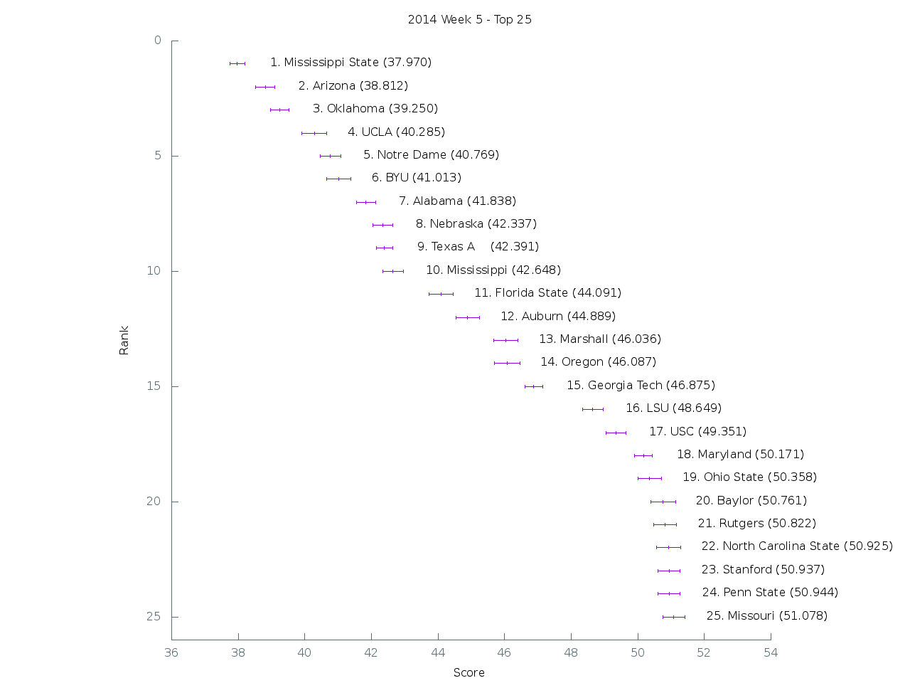

[Graph of all teams](img/week5.png)

 Rank | Team                           | Score      | Uncertainty
------|--------------------------------|------------|------------
    1 | Mississippi State         |  37.969600 |   0.222098
    2 | Arizona                   |  38.812400 |   0.292769
    3 | Oklahoma                  |  39.250000 |   0.279982
    4 | UCLA                      |  40.284700 |   0.367258
    5 | Notre Dame                |  40.769300 |   0.307385
    6 | BYU                       |  41.013300 |   0.364901
    7 | Alabama                   |  41.838100 |   0.292428
    8 | Nebraska                  |  42.336600 |   0.301331
    9 | Texas A&M                 |  42.390700 |   0.247692
   10 | Mississippi               |  42.648200 |   0.307374
   11 | Florida State             |  44.091000 |   0.356855
   12 | Auburn                    |  44.888700 |   0.352896
   13 | Marshall                  |  46.035700 |   0.357453
   14 | Oregon                    |  46.087400 |   0.383194
   15 | Georgia Tech              |  46.875400 |   0.272534
   16 | LSU                       |  48.648600 |   0.309666
   17 | USC                       |  49.351000 |   0.295622
   18 | Maryland                  |  50.170900 |   0.262423
   19 | Ohio State                |  50.358300 |   0.350729
   20 | Baylor                    |  50.760700 |   0.371089
   21 | Rutgers                   |  50.821600 |   0.335753
   22 | North Carolina State      |  50.925500 |   0.363795
   23 | Stanford                  |  50.936600 |   0.322271
   24 | Penn State                |  50.944000 |   0.331362
   25 | Missouri                  |  51.078100 |   0.333610
   26 | TCU                       |  51.245500 |   0.296611
   27 | Kentucky                  |  51.450200 |   0.409894
   28 | Minnesota                 |  52.096800 |   0.249097
   29 | Washington                |  52.535600 |   0.307623
   30 | East Carolina             |  53.883400 |   0.394654
   31 | Georgia                   |  54.118800 |   0.364253
   32 | California                |  54.218800 |   0.364536
   33 | Louisiana-Monroe          |  54.465900 |   0.321183
   34 | Wisconsin                 |  54.636200 |   0.332824
   35 | Duke                      |  54.700500 |   0.306254
   36 | Air Force                 |  54.811700 |   0.360098
   37 | Oklahoma State            |  55.005800 |   0.417452
   38 | South Carolina            |  55.048900 |   0.329454
   39 | Colorado State            |  55.110600 |   0.365361
   40 | Michigan State            |  55.559700 |   0.291542
   41 | Arizona State             |  55.932800 |   0.385443
   42 | Arkansas                  |  56.630800 |   0.355503
   43 | Oregon State              |  57.137800 |   0.276910
   44 | Miami (Fla.)              |  57.240500 |   0.320557
   45 | Louisville                |  57.339500 |   0.365584
   46 | Kansas State              |  57.394600 |   0.335520
   47 | Boise State               |  57.435400 |   0.241811
   48 | Northern Illinois         |  57.452100 |   0.336907
   49 | Temple                    |  57.962500 |   0.328644
   50 | Texas                     |  58.463000 |   0.353972
   51 | Iowa                      |  58.483100 |   0.249571
   52 | Illinois                  |  58.591400 |   0.326244
   53 | Virginia                  |  59.374600 |   0.366197
   54 | Virginia Tech             |  59.530300 |   0.337297
   55 | Georgia Southern          |  59.719700 |   0.355868
   56 | Florida                   |  60.028100 |   0.472949
   57 | Tennessee                 |  60.066400 |   0.309533
   58 | Utah                      |  60.304600 |   0.355944
   59 | Middle Tennessee          |  60.342100 |   0.307278
   60 | Boston College            |  60.390600 |   0.327242
   61 | Nevada                    |  60.686000 |   0.447222
   62 | UTEP                      |  60.994300 |   0.307916
   63 | Old Dominion              |  61.588200 |   0.354294
   64 | Cincinnati                |  61.602500 |   0.370953
   65 | Western Kentucky          |  61.610300 |   0.330388
   66 | Wyoming                   |  61.703500 |   0.320258
   67 | Ohio                      |  61.805600 |   0.340121
   68 | Northwestern              |  62.146000 |   0.384423
   69 | West Virginia             |  62.357400 |   0.330789
   70 | South Alabama             |  62.503700 |   0.323234
   71 | Akron                     |  62.889900 |   0.357640
   72 | Bowling Green             |  62.944500 |   0.349638
   73 | Memphis                   |  63.259200 |   0.399767
   74 | Florida Atlantic          |  63.630500 |   0.299957
   75 | Clemson                   |  63.914500 |   0.444436
   76 | Syracuse                  |  64.174000 |   0.339760
   77 | Indiana                   |  64.282600 |   0.385056
   78 | Houston                   |  64.557600 |   0.371759
   79 | Arkansas State            |  64.854300 |   0.369037
   80 | Texas State               |  65.170300 |   0.431509
   81 | Navy                      |  65.635800 |   0.322164
   82 | North Texas               |  65.939200 |   0.371171
   83 | Toledo                    |  66.105700 |   0.371586
   84 | Washington State          |  66.251000 |   0.302165
   85 | San Diego State           |  66.291500 |   0.346784
   86 | Texas Tech                |  66.298700 |   0.355663
   87 | Kansas                    |  66.581900 |   0.280292
   88 | Colorado                  |  66.825500 |   0.289648
   89 | Western Michigan          |  66.852200 |   0.329379
   90 | Utah State                |  67.133000 |   0.339380
   91 | Army                      |  68.099000 |   0.327564
   92 | North Carolina            |  68.375100 |   0.365628
   93 | Rice                      |  68.413300 |   0.276583
   94 | Pittsburgh                |  68.935000 |   0.377190
   95 | Purdue                    |  69.248800 |   0.318690
   96 | Wake Forest               |  69.914300 |   0.246819
   97 | Fresno State              |  70.046800 |   0.311708
   98 | Michigan                  |  70.147900 |   0.291537
   99 | Southern Miss             |  70.277600 |   0.309106
  100 | South Florida             |  70.339700 |   0.361265
  101 | Buffalo                   |  70.987400 |   0.415911
  102 | UCF                       |  71.116400 |   0.335710
  103 | San Jose State            |  71.252300 |   0.434910
  104 | New Mexico State          |  71.497900 |   0.297988
  105 | UTSA                      |  72.234800 |   0.299313
  106 | New Mexico                |  72.315700 |   0.340816
  107 | Tulsa                     |  73.443800 |   0.336185
  108 | Central Michigan          |  73.741700 |   0.339796
  109 | Vanderbilt                |  73.887500 |   0.305830
  110 | Louisiana-Lafayette       |  74.171000 |   0.387237
  111 | UAB                       |  75.252300 |   0.294215
  112 | Georgia State             |  75.707400 |   0.352602
  113 | Appalachian State         |  76.515200 |   0.325585
  114 | Eastern Michigan          |  76.962200 |   0.307011
  115 | Hawaii                    |  77.199900 |   0.405828
  116 | Tulane                    |  78.654300 |   0.318101
  117 | SMU                       |  79.055200 |   0.261878
  118 | Connecticut               |  80.121200 |   0.310879
  119 | Idaho                     |  80.168500 |   0.259093
  120 | Kent State                |  80.766700 |   0.280119
  121 | UNLV                      |  81.316200 |   0.290693
  122 | Massachusetts             |  83.764500 |   0.353484
  123 | Florida International     | 109.357700 |   0.081122
  124 | Iowa State                | 114.128600 |   0.055625
  125 | Miami (Ohio)              | 124.000000 |   0.000000
  126 | Ball State                | 125.000000 |   0.000000
  127 | Troy                      | 126.000000 |   0.000000
  128 | Louisiana Tech            | 127.000000 |   0.000000
