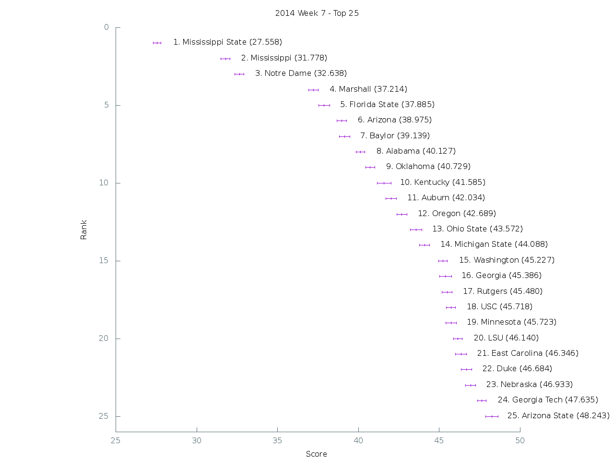

[Graph of all teams](img/week7.png)

 Rank | Team                           | Score      | Uncertainty
------|--------------------------------|------------|------------
    1 | Mississippi State         |  27.557500 |   0.237466
    2 | Mississippi               |  31.778000 |   0.270321
    3 | Notre Dame                |  32.638400 |   0.277236
    4 | Marshall                  |  37.214100 |   0.304304
    5 | Florida State             |  37.885000 |   0.335802
    6 | Arizona                   |  38.975500 |   0.289385
    7 | Baylor                    |  39.139400 |   0.330988
    8 | Alabama                   |  40.127300 |   0.266598
    9 | Oklahoma                  |  40.729200 |   0.281687
   10 | Kentucky                  |  41.585200 |   0.435082
   11 | Auburn                    |  42.033800 |   0.325900
   12 | Oregon                    |  42.689300 |   0.304919
   13 | Ohio State                |  43.572300 |   0.354462
   14 | Michigan State            |  44.088000 |   0.312923
   15 | Washington                |  45.227200 |   0.273352
   16 | Georgia                   |  45.385900 |   0.360921
   17 | Rutgers                   |  45.480000 |   0.314863
   18 | USC                       |  45.717900 |   0.285123
   19 | Minnesota                 |  45.723100 |   0.325479
   20 | LSU                       |  46.140100 |   0.267181
   21 | East Carolina             |  46.346500 |   0.346631
   22 | Duke                      |  46.684100 |   0.317387
   23 | Nebraska                  |  46.932900 |   0.311840
   24 | Georgia Tech              |  47.635400 |   0.263439
   25 | Arizona State             |  48.243500 |   0.382510
   26 | Texas A&M                 |  48.268300 |   0.272649
   27 | TCU                       |  48.362200 |   0.298785
   28 | Stanford                  |  50.103400 |   0.340489
   29 | UCLA                      |  50.500100 |   0.294730
   30 | Utah                      |  50.768300 |   0.354628
   31 | Boise State               |  50.785700 |   0.387539
   32 | Clemson                   |  51.136500 |   0.267128
   33 | Oklahoma State            |  51.356200 |   0.355188
   34 | Oregon State              |  51.537000 |   0.350052
   35 | Colorado State            |  51.553800 |   0.414357
   36 | Utah State                |  52.590100 |   0.340937
   37 | Iowa                      |  52.623300 |   0.342949
   38 | Georgia Southern          |  52.765000 |   0.285632
   39 | Kansas State              |  53.183900 |   0.384416
   40 | Maryland                  |  53.229300 |   0.283120
   41 | Bowling Green             |  53.347600 |   0.337352
   42 | West Virginia             |  53.656300 |   0.302155
   43 | Boston College            |  53.887900 |   0.361126
   44 | Virginia Tech             |  54.290000 |   0.367463
   45 | California                |  54.487100 |   0.354016
   46 | Temple                    |  54.785400 |   0.363899
   47 | Virginia                  |  54.800400 |   0.367886
   48 | Arkansas State            |  54.842700 |   0.319846
   49 | BYU                       |  55.018900 |   0.325567
   50 | Missouri                  |  55.481200 |   0.319187
   51 | Miami (Fla.)              |  55.683900 |   0.291995
   52 | Air Force                 |  56.041200 |   0.252681
   53 | Wisconsin                 |  56.085600 |   0.335162
   54 | UCF                       |  57.552300 |   0.325959
   55 | Louisville                |  57.899800 |   0.310395
   56 | Florida                   |  58.233700 |   0.285872
   57 | Penn State                |  58.407800 |   0.302853
   58 | Middle Tennessee          |  58.647200 |   0.318961
   59 | South Alabama             |  58.843400 |   0.323496
   60 | Akron                     |  58.994700 |   0.361737
   61 | South Carolina            |  59.219300 |   0.298893
   62 | Arkansas                  |  59.473200 |   0.328530
   63 | Rice                      |  59.808100 |   0.329165
   64 | Central Michigan          |  59.890900 |   0.289018
   65 | Northwestern              |  60.361500 |   0.317507
   66 | Northern Illinois         |  60.604800 |   0.376883
   67 | Nevada                    |  60.819900 |   0.405300
   68 | Texas State               |  61.116600 |   0.358699
   69 | North Carolina State      |  61.637000 |   0.296449
   70 | Indiana                   |  63.477000 |   0.418158
   71 | UAB                       |  63.814500 |   0.309164
   72 | Michigan                  |  63.823400 |   0.289642
   73 | Houston                   |  63.825800 |   0.351034
   74 | Memphis                   |  64.232200 |   0.261720
   75 | Texas                     |  64.865600 |   0.323533
   76 | Louisiana-Monroe          |  64.867200 |   0.336173
   77 | Tennessee                 |  65.509400 |   0.339646
   78 | Purdue                    |  66.550000 |   0.311069
   79 | San Diego State           |  66.806400 |   0.334255
   80 | Wyoming                   |  68.236900 |   0.342584
   81 | Western Kentucky          |  68.430300 |   0.346279
   82 | Navy                      |  68.937000 |   0.369690
   83 | Illinois                  |  69.499700 |   0.291145
   84 | Louisiana-Lafayette       |  70.445600 |   0.397793
   85 | Colorado                  |  70.559000 |   0.347230
   86 | UTEP                      |  70.693000 |   0.223381
   87 | Syracuse                  |  70.701600 |   0.475077
   88 | Old Dominion              |  71.147500 |   0.313198
   89 | San Jose State            |  71.208600 |   0.421304
   90 | Cincinnati                |  71.361000 |   0.359138
   91 | Ohio                      |  71.978000 |   0.290918
   92 | Western Michigan          |  72.221400 |   0.369927
   93 | Fresno State              |  72.839700 |   0.282380
   94 | New Mexico                |  72.869900 |   0.298461
   95 | Tulane                    |  72.958800 |   0.277991
   96 | North Carolina            |  73.149800 |   0.387507
   97 | South Florida             |  73.165200 |   0.331771
   98 | Pittsburgh                |  73.206400 |   0.454345
   99 | Hawaii                    |  73.378300 |   0.347963
  100 | Army                      |  73.460300 |   0.358151
  101 | Washington State          |  74.051900 |   0.294623
  102 | Wake Forest               |  74.343200 |   0.337106
  103 | Toledo                    |  74.521300 |   0.335865
  104 | Texas Tech                |  74.587600 |   0.349018
  105 | Kansas                    |  75.158600 |   0.340275
  106 | Southern Miss             |  75.293100 |   0.375977
  107 | Eastern Michigan          |  76.100000 |   0.255110
  108 | North Texas               |  76.630000 |   0.341092
  109 | UTSA                      |  76.792800 |   0.329544
  110 | Florida Atlantic          |  77.056200 |   0.289470
  111 | Vanderbilt                |  78.496500 |   0.300954
  112 | UNLV                      |  79.779200 |   0.321287
  113 | Tulsa                     |  81.031800 |   0.313445
  114 | Buffalo                   |  81.901400 |   0.393252
  115 | SMU                       |  83.117300 |   0.346188
  116 | Georgia State             |  84.679700 |   0.329964
  117 | Connecticut               |  86.799200 |   0.307849
  118 | Idaho                     |  86.917900 |   0.284653
  119 | New Mexico State          |  88.244000 |   0.269827
  120 | Massachusetts             |  90.353400 |   0.247447
  121 | Kent State                |  90.493700 |   0.278167
  122 | Iowa State                | 105.460100 |   0.097655
  123 | Florida International     | 105.995100 |   0.108108
  124 | Troy                      | 114.413800 |   0.081457
  125 | Louisiana Tech            | 114.583800 |   0.055557
  126 | Miami (Ohio)              | 117.770400 |   0.062761
  127 | Ball State                | 125.997400 |   0.000623
  128 | Appalachian State         | 127.000000 |   0.000000
