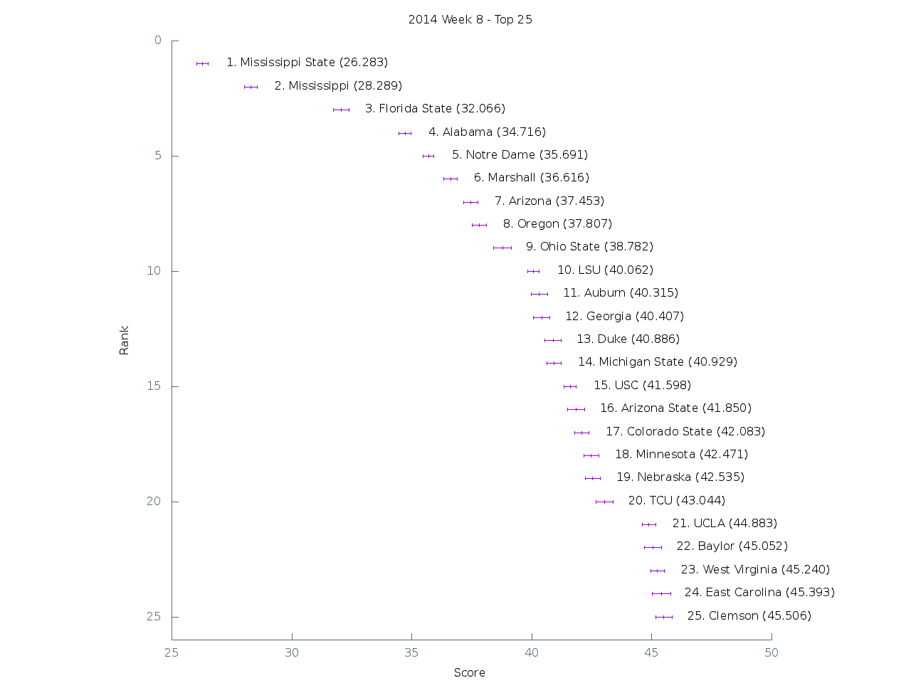

[Graph of all teams](img/week8.png)

 Rank | Team                           | Score      | Uncertainty
------|--------------------------------|------------|------------
    1 | Mississippi State         |  26.283000 |   0.240248
    2 | Mississippi               |  28.289300 |   0.259947
    3 | Florida State             |  32.065500 |   0.328241
    4 | Alabama                   |  34.716000 |   0.260165
    5 | Notre Dame                |  35.691200 |   0.229115
    6 | Marshall                  |  36.615800 |   0.281379
    7 | Arizona                   |  37.452700 |   0.286028
    8 | Oregon                    |  37.806900 |   0.304712
    9 | Ohio State                |  38.782000 |   0.368092
   10 | LSU                       |  40.061800 |   0.243233
   11 | Auburn                    |  40.315200 |   0.340941
   12 | Georgia                   |  40.406600 |   0.336084
   13 | Duke                      |  40.885900 |   0.334088
   14 | Michigan State            |  40.928700 |   0.305392
   15 | USC                       |  41.597900 |   0.256440
   16 | Arizona State             |  41.849700 |   0.362776
   17 | Colorado State            |  42.083400 |   0.298867
   18 | Minnesota                 |  42.471400 |   0.308581
   19 | Nebraska                  |  42.534900 |   0.305223
   20 | TCU                       |  43.044100 |   0.355156
   21 | UCLA                      |  44.883300 |   0.287370
   22 | Baylor                    |  45.052100 |   0.357882
   23 | West Virginia             |  45.240000 |   0.282891
   24 | East Carolina             |  45.392700 |   0.389285
   25 | Clemson                   |  45.505600 |   0.332514
   26 | Kansas State              |  45.632600 |   0.388820
   27 | Oklahoma                  |  45.709400 |   0.302465
   28 | Kentucky                  |  46.562700 |   0.321760
   29 | Boise State               |  47.530100 |   0.332665
   30 | Maryland                  |  47.897900 |   0.302874
   31 | Washington                |  49.412400 |   0.317262
   32 | Rutgers                   |  49.601600 |   0.334476
   33 | Utah                      |  49.873400 |   0.370889
   34 | Missouri                  |  49.970000 |   0.277486
   35 | Texas A&M                 |  50.237000 |   0.320859
   36 | Oregon State              |  52.121300 |   0.348288
   37 | Louisville                |  52.502900 |   0.333864
   38 | Georgia Southern          |  52.848100 |   0.420723
   39 | Air Force                 |  52.995700 |   0.333870
   40 | UCF                       |  53.922200 |   0.335546
   41 | Stanford                  |  54.086700 |   0.343045
   42 | Middle Tennessee          |  54.617800 |   0.320262
   43 | Arkansas State            |  55.071200 |   0.269239
   44 | Miami (Fla.)              |  55.118700 |   0.314045
   45 | Oklahoma State            |  55.294600 |   0.341236
   46 | Utah State                |  55.700300 |   0.307715
   47 | Georgia Tech              |  56.365200 |   0.294940
   48 | South Alabama             |  56.415100 |   0.337973
   49 | Wisconsin                 |  56.431600 |   0.375183
   50 | Houston                   |  57.172800 |   0.324424
   51 | Penn State                |  57.309500 |   0.354128
   52 | Iowa                      |  57.412200 |   0.315492
   53 | Boston College            |  58.051800 |   0.356126
   54 | South Carolina            |  58.052200 |   0.321566
   55 | Nevada                    |  58.378100 |   0.280068
   56 | California                |  58.438200 |   0.325725
   57 | Virginia                  |  58.557000 |   0.379285
   58 | Rice                      |  59.186800 |   0.348117
   59 | Northern Illinois         |  59.723100 |   0.337227
   60 | BYU                       |  60.459500 |   0.237695
   61 | Temple                    |  60.716100 |   0.370368
   62 | Bowling Green             |  61.326500 |   0.351096
   63 | Virginia Tech             |  62.059800 |   0.304166
   64 | Louisiana-Lafayette       |  62.320400 |   0.330800
   65 | Florida                   |  62.922000 |   0.325068
   66 | Arkansas                  |  63.014500 |   0.345539
   67 | Northwestern              |  63.086600 |   0.271718
   68 | Michigan                  |  64.165400 |   0.349774
   69 | Texas                     |  64.384800 |   0.304414
   70 | Western Michigan          |  64.484400 |   0.384364
   71 | Memphis                   |  64.812100 |   0.330451
   72 | North Carolina            |  64.820000 |   0.356164
   73 | Pittsburgh                |  64.954000 |   0.379949
   74 | Ohio                      |  64.976900 |   0.295017
   75 | Akron                     |  65.323800 |   0.338667
   76 | Louisiana-Monroe          |  65.455000 |   0.378690
   77 | Syracuse                  |  65.686200 |   0.312379
   78 | North Carolina State      |  65.968800 |   0.299937
   79 | Indiana                   |  66.316100 |   0.290554
   80 | Tennessee                 |  66.373300 |   0.406526
   81 | Cincinnati                |  67.763900 |   0.307007
   82 | San Diego State           |  67.976400 |   0.337934
   83 | Texas State               |  68.388000 |   0.360793
   84 | UAB                       |  68.535600 |   0.292326
   85 | South Florida             |  69.430300 |   0.348791
   86 | Purdue                    |  69.527100 |   0.342984
   87 | Wyoming                   |  70.070200 |   0.397145
   88 | Navy                      |  70.121800 |   0.385304
   89 | Illinois                  |  70.251700 |   0.350496
   90 | Texas Tech                |  70.777200 |   0.351630
   91 | Southern Miss             |  71.051700 |   0.358374
   92 | Old Dominion              |  71.443400 |   0.364522
   93 | UTEP                      |  71.524600 |   0.280386
   94 | San Jose State            |  71.804100 |   0.424176
   95 | Florida Atlantic          |  72.095100 |   0.215393
   96 | Colorado                  |  72.915300 |   0.333397
   97 | Washington State          |  74.743600 |   0.365577
   98 | Hawaii                    |  74.782400 |   0.300881
   99 | Western Kentucky          |  75.078700 |   0.310251
  100 | Fresno State              |  75.621200 |   0.295263
  101 | Central Michigan          |  76.103400 |   0.215957
  102 | Toledo                    |  76.535200 |   0.321997
  103 | New Mexico                |  76.604800 |   0.260269
  104 | Tulane                    |  77.859400 |   0.302691
  105 | Vanderbilt                |  78.467900 |   0.359372
  106 | Wake Forest               |  79.950500 |   0.290894
  107 | Kansas                    |  80.064300 |   0.287656
  108 | Army                      |  81.211800 |   0.315616
  109 | UNLV                      |  81.252900 |   0.287468
  110 | North Texas               |  81.800100 |   0.324890
  111 | Buffalo                   |  81.925900 |   0.314120
  112 | Eastern Michigan          |  82.731300 |   0.315662
  113 | Idaho                     |  84.259300 |   0.284930
  114 | Kent State                |  84.287200 |   0.230893
  115 | Massachusetts             |  85.594300 |   0.253774
  116 | Tulsa                     |  85.645400 |   0.244407
  117 | UTSA                      |  87.425500 |   0.228800
  118 | SMU                       |  87.436600 |   0.371430
  119 | Georgia State             |  88.028700 |   0.379231
  120 | Connecticut               |  88.051100 |   0.329490
  121 | New Mexico State          |  93.601900 |   0.191586
  122 | Louisiana Tech            | 107.094200 |   0.084718
  123 | Florida International     | 109.508900 |   0.082106
  124 | Iowa State                | 109.771600 |   0.089018
  125 | Ball State                | 111.243500 |   0.060733
  126 | Troy                      | 120.011200 |   0.040368
  127 | Miami (Ohio)              | 120.531900 |   0.064674
  128 | Appalachian State         | 125.316800 |   0.013607
