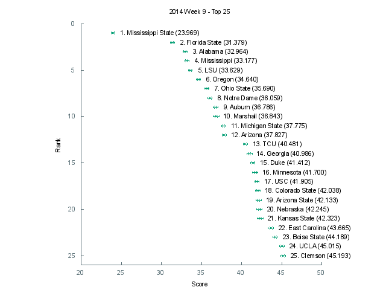

[Graph of all teams](img/week9.png)

 Rank | Team                           | Score      | Uncertainty
------|--------------------------------|------------|------------
    1 | Mississippi State         |  23.968600 |   0.211661
    2 | Florida State             |  31.378800 |   0.264576
    3 | Alabama                   |  32.964400 |   0.293331
    4 | Mississippi               |  33.177400 |   0.274916
    5 | LSU                       |  33.629100 |   0.242898
    6 | Oregon                    |  34.639700 |   0.250650
    7 | Ohio State                |  35.690300 |   0.263244
    8 | Notre Dame                |  36.058700 |   0.274737
    9 | Auburn                    |  36.785600 |   0.294595
   10 | Marshall                  |  36.843200 |   0.403698
   11 | Michigan State            |  37.774900 |   0.272187
   12 | Arizona                   |  37.827000 |   0.262997
   13 | TCU                       |  40.481500 |   0.270650
   14 | Georgia                   |  40.985600 |   0.333665
   15 | Duke                      |  41.411800 |   0.264007
   16 | Minnesota                 |  41.700300 |   0.365205
   17 | USC                       |  41.904600 |   0.245267
   18 | Colorado State            |  42.038100 |   0.293942
   19 | Arizona State             |  42.133000 |   0.311908
   20 | Nebraska                  |  42.244900 |   0.333633
   21 | Kansas State              |  42.323200 |   0.395111
   22 | East Carolina             |  43.665200 |   0.343812
   23 | Boise State               |  44.189200 |   0.258118
   24 | UCLA                      |  45.015400 |   0.286523
   25 | Clemson                   |  45.193100 |   0.298143
   26 | Oklahoma                  |  45.375700 |   0.322181
   27 | West Virginia             |  45.646300 |   0.354064
   28 | Baylor                    |  45.874200 |   0.375702
   29 | Maryland                  |  47.969500 |   0.274940
   30 | Kentucky                  |  48.504300 |   0.317906
   31 | Rutgers                   |  49.068500 |   0.281634
   32 | Washington                |  49.329600 |   0.303187
   33 | Missouri                  |  49.585000 |   0.337066
   34 | Texas A&M                 |  49.626300 |   0.332623
   35 | Utah                      |  50.428600 |   0.257179
   36 | Miami (Fla.)              |  51.789500 |   0.295551
   37 | Oregon State              |  52.010300 |   0.445453
   38 | Air Force                 |  52.200500 |   0.289675
   39 | Louisville                |  52.901900 |   0.348692
   40 | UCF                       |  53.164500 |   0.335005
   41 | Georgia Southern          |  53.223000 |   0.309684
   42 | Middle Tennessee          |  54.353400 |   0.293252
   43 | Stanford                  |  54.374900 |   0.328300
   44 | Oklahoma State            |  54.466800 |   0.346157
   45 | Wisconsin                 |  55.580700 |   0.346655
   46 | Utah State                |  55.695400 |   0.281180
   47 | Georgia Tech              |  56.063300 |   0.299021
   48 | Louisiana-Lafayette       |  56.187000 |   0.372549
   49 | Iowa                      |  57.021800 |   0.270703
   50 | South Alabama             |  57.079800 |   0.317229
   51 | Houston                   |  57.204800 |   0.338727
   52 | Virginia                  |  57.922600 |   0.359101
   53 | Boston College            |  57.927700 |   0.357819
   54 | Nevada                    |  58.749700 |   0.332491
   55 | Rice                      |  59.573300 |   0.313340
   56 | Penn State                |  59.703700 |   0.311421
   57 | Northern Illinois         |  60.050600 |   0.319846
   58 | Temple                    |  60.540100 |   0.421658
   59 | Bowling Green             |  60.732300 |   0.286806
   60 | Arkansas State            |  61.051400 |   0.345255
   61 | California                |  61.096000 |   0.323713
   62 | South Carolina            |  61.750500 |   0.307392
   63 | Cincinnati                |  62.179000 |   0.302796
   64 | Florida                   |  62.811600 |   0.372822
   65 | BYU                       |  63.004900 |   0.233248
   66 | Arkansas                  |  63.109900 |   0.349249
   67 | Northwestern              |  63.262700 |   0.294765
   68 | San Diego State           |  63.397300 |   0.364239
   69 | Memphis                   |  64.229700 |   0.391783
   70 | Ohio                      |  64.646400 |   0.234663
   71 | North Carolina            |  64.648000 |   0.343046
   72 | Western Michigan          |  64.840100 |   0.302302
   73 | Louisiana-Monroe          |  65.267800 |   0.408663
   74 | Pittsburgh                |  65.388400 |   0.331478
   75 | North Carolina State      |  65.603100 |   0.340454
   76 | Virginia Tech             |  65.797400 |   0.273955
   77 | Indiana                   |  65.820100 |   0.374720
   78 | Akron                     |  66.045600 |   0.349583
   79 | Syracuse                  |  66.139800 |   0.300863
   80 | Michigan                  |  66.756700 |   0.360398
   81 | Texas                     |  67.949500 |   0.328766
   82 | UAB                       |  67.996500 |   0.271088
   83 | Tennessee                 |  68.349900 |   0.417270
   84 | Texas State               |  68.712900 |   0.363455
   85 | Purdue                    |  69.099700 |   0.334721
   86 | Illinois                  |  69.517200 |   0.316479
   87 | Wyoming                   |  69.659000 |   0.344359
   88 | Navy                      |  69.778300 |   0.348383
   89 | San Jose State            |  71.225800 |   0.397437
   90 | Southern Miss             |  71.376600 |   0.360925
   91 | Old Dominion              |  71.854900 |   0.326762
   92 | Florida Atlantic          |  72.215400 |   0.215385
   93 | UTEP                      |  72.328900 |   0.325693
   94 | Colorado                  |  72.993800 |   0.393660
   95 | Texas Tech                |  73.036000 |   0.312487
   96 | Western Kentucky          |  74.211100 |   0.293350
   97 | South Florida             |  74.551300 |   0.385593
   98 | Washington State          |  74.569500 |   0.310831
   99 | Central Michigan          |  76.185700 |   0.293432
  100 | Toledo                    |  76.205100 |   0.333270
  101 | Fresno State              |  76.484100 |   0.261748
  102 | New Mexico                |  77.205600 |   0.269798
  103 | Tulane                    |  77.999800 |   0.353373
  104 | Hawaii                    |  78.814400 |   0.285051
  105 | Wake Forest               |  79.364600 |   0.357503
  106 | Vanderbilt                |  79.599500 |   0.385957
  107 | UNLV                      |  80.881900 |   0.299928
  108 | Kansas                    |  80.928000 |   0.369537
  109 | Army                      |  81.192700 |   0.302624
  110 | North Texas               |  82.169800 |   0.321605
  111 | Buffalo                   |  83.117200 |   0.398521
  112 | Eastern Michigan          |  83.914900 |   0.274374
  113 | Kent State                |  84.172000 |   0.234651
  114 | Idaho                     |  84.665600 |   0.241149
  115 | Tulsa                     |  86.082600 |   0.311196
  116 | Massachusetts             |  86.206500 |   0.170465
  117 | UTSA                      |  87.662200 |   0.306737
  118 | Georgia State             |  88.323000 |   0.276802
  119 | Connecticut               |  88.730700 |   0.259837
  120 | SMU                       |  88.739800 |   0.365193
  121 | New Mexico State          |  94.100600 |   0.218772
  122 | Louisiana Tech            | 107.585200 |   0.107889
  123 | Florida International     | 109.766700 |   0.083049
  124 | Iowa State                | 109.985900 |   0.094078
  125 | Ball State                | 111.535600 |   0.077566
  126 | Troy                      | 120.145500 |   0.042119
  127 | Miami (Ohio)              | 120.672600 |   0.044218
  128 | Appalachian State         | 125.340300 |   0.015090
